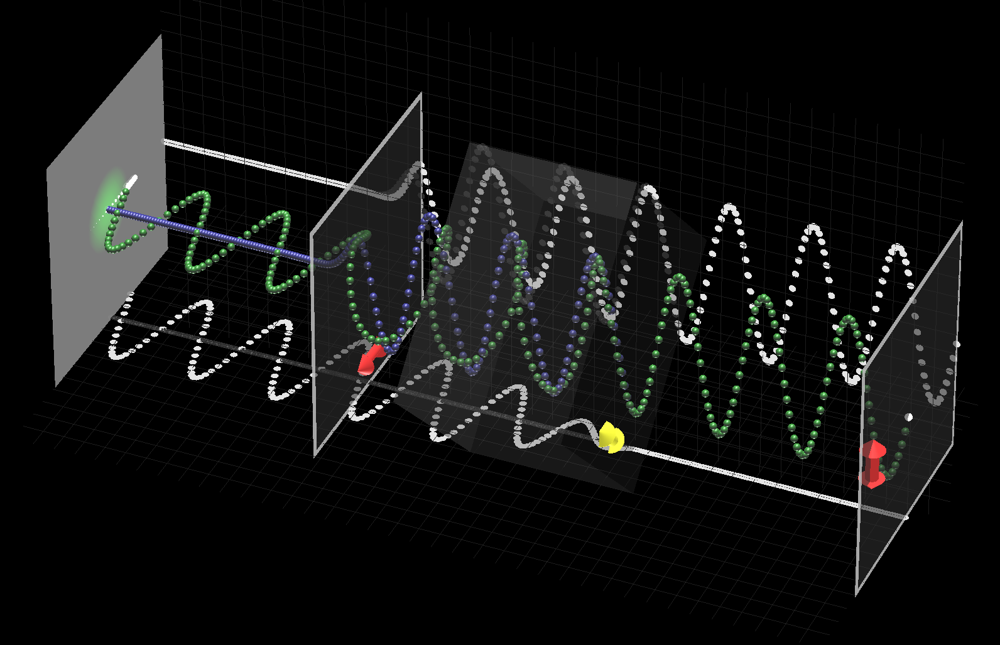

# PolarizationAnimation

円偏光やゼノ効果の理解のためのデモです。OpenGLで描画してOpenCVでキャプチャして動画にしています。アウトリーチで使用しました。

マウスで操作できるほかコマンドで調整が効きます。細かい内容はソースコードを読んでください。

OpenCVでキャプチャした動画がtwitterにあります。
 - Zeno効果：https://twitter.com/iKodack/status/723816158298697728
 - 偏光による強度調整：https://twitter.com/iKodack/status/723818299662815232
 - 円偏光の仕組み：https://twitter.com/iKodack/status/723820329060028416
